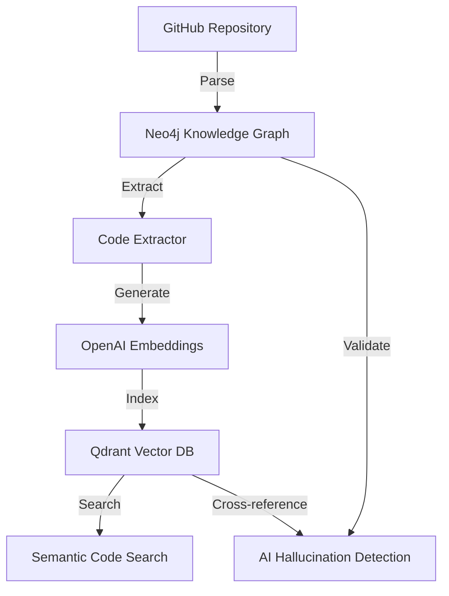

# Neo4j-Qdrant Bridge Documentation

## Overview

The Neo4j-Qdrant bridge creates a seamless integration between structured code knowledge (Neo4j graph database) and semantic search capabilities (Qdrant vector database). This bridge enables advanced code search, AI hallucination detection, and intelligent code validation.

## Architecture



### Components

1. **Neo4j Knowledge Graph**: Stores structured repository data
   - Repository nodes with metadata
   - File nodes with paths and module information
   - Class nodes with relationships
   - Method nodes with parameters and return types
   - Function nodes for standalone functions
   - Attribute nodes for class properties

2. **Code Extractor** (`src/knowledge_graph/code_extractor.py`):
   - Extracts structured code from Neo4j
   - Generates meaningful code representations
   - Creates rich metadata for search and validation

3. **Qdrant Vector Database**: Enables semantic search
   - Stores code embeddings with metadata
   - Supports filtering by repository, class, method
   - Enables similarity-based code search

## Key Features

### 🔍 Semantic Code Search

- Search for code examples using natural language
- Find similar implementations across repositories
- Filter by repository, class, or method signatures

### 🛡️ AI Hallucination Detection

- Cross-reference AI-generated code against known patterns
- Validate method signatures and class structures
- Provide confidence scores for code validation

### 📊 Rich Metadata Schema

- Repository information (name, file paths)
- Code structure (classes, methods, functions)
- Parameter types and return types
- Validation status and confidence scores

### ⚡ Efficient Batch Operations

- Handle large repositories efficiently
- Batch embedding generation
- Optimized vector storage operations

## Usage

### 1. Parse Repository into Neo4j

First, parse a GitHub repository into the Neo4j knowledge graph:

```python
# Using MCP tool
result = await parse_github_repository("https://github.com/user/repo.git")

# Or using direct script
python knowledge_graphs/parse_repo_into_neo4j.py
```

### 2. Extract and Index Code

Use the bridge to extract code from Neo4j and index in Qdrant:

```python
# Using MCP tool
result = await extract_and_index_repository_code("repo-name")

# Response format:
{
  "success": true,
  "repository_name": "repo-name",
  "indexed_count": 150,
  "extraction_summary": {
    "classes": 25,
    "methods": 120,
    "functions": 30
  },
  "storage_summary": {
    "embeddings_generated": 150,
    "examples_stored": 150,
    "total_code_words": 12500
  }
}
```

### 3. Search Indexed Code

Search for code examples using natural language:

```python
# Semantic search
results = await search_code_examples(
    query="user authentication method",
    source_id="repo-name",
    match_count=5
)

# Signature-based search  
results = await database_client.search_code_by_signature(
    method_name="authenticate",
    class_name="User",
    repo_filter="repo-name"
)
```

### 4. Repository Management

Manage repository-specific code examples:

```python
# Get all code examples for a repository
examples = await database_client.get_repository_code_examples(
    repo_name="repo-name",
    code_type="method"  # Optional filter
)

# Delete repository code examples
await database_client.delete_repository_code_examples("repo-name")
```

## Code Example Metadata Schema

Each indexed code example includes rich metadata:

```json
{
  "repository_name": "example-repo",
  "file_path": "src/auth/user.py", 
  "module_name": "src.auth.user",
  "code_type": "method",
  "name": "authenticate",
  "full_name": "User.authenticate",
  "class_name": "User",
  "parameters": ["self", "username", "password"],
  "return_type": "bool",
  "language": "python",
  "validation_status": "extracted"
}
```

## Environment Configuration

Required environment variables:

```bash
# Neo4j Configuration
NEO4J_URI=bolt://localhost:7687
NEO4J_USER=neo4j
NEO4J_PASSWORD=your_password

# Qdrant Configuration  
QDRANT_URL=http://localhost:6333
QDRANT_API_KEY=your_api_key  # Optional

# OpenAI for Embeddings
OPENAI_API_KEY=your_openai_key

# Enable Knowledge Graph
USE_KNOWLEDGE_GRAPH=true
```

## Testing

Run the comprehensive bridge test:

```bash
python test_neo4j_qdrant_bridge.py
```

This test validates:

- Neo4j connection and repository data
- Code extraction from knowledge graph
- Embedding generation and Qdrant storage
- Semantic search functionality
- Repository-specific queries
- Data integrity and validation

## Performance Considerations

### Batch Processing

- Embeddings are generated in batches (default: 20 texts per batch)
- Qdrant operations use batch upserts (default: 100 points per batch)
- Large repositories are processed incrementally

### Memory Management

- Code examples are processed in chunks to avoid memory issues
- Old repository data is cleaned before re-indexing
- Efficient Neo4j queries with result limiting

### Scalability

- Supports repositories with 1000+ classes/methods
- Handles embedding dimensions (1536 for OpenAI)
- Optimized vector search with metadata filtering

## Error Handling

The bridge includes comprehensive error handling:

```python
# Graceful degradation
if not neo4j_available:
    return {"error": "Neo4j not configured"}

if not embeddings_generated:
    return {"error": "Embedding generation failed"}

# Cleanup on failure
try:
    await store_in_qdrant(examples)
except Exception as e:
    await cleanup_partial_data()
    raise
```

## Integration with AI Validation

The bridge supports AI hallucination detection:

1. **Code Pattern Matching**: Cross-reference generated code against known patterns
2. **Signature Validation**: Verify method signatures exist in the knowledge graph
3. **Context Validation**: Check if code usage matches actual implementations
4. **Confidence Scoring**: Provide confidence scores for validation results

## Future Enhancements

- [ ] Support for multiple programming languages
- [ ] Incremental updates for changed repositories
- [ ] Advanced semantic search with query expansion
- [ ] Code similarity clustering and recommendations
- [ ] Integration with code generation models
- [ ] Performance metrics and monitoring dashboard

## Troubleshooting

### Common Issues

1. **No repositories found**:
   - Ensure repositories are parsed into Neo4j first
   - Check Neo4j connection and credentials

2. **Embedding generation fails**:
   - Verify OpenAI API key is valid
   - Check rate limits and quotas

3. **Qdrant storage errors**:
   - Ensure Qdrant is running and accessible
   - Check vector dimensions match (1536 for OpenAI)

4. **Search returns no results**:
   - Verify code examples are indexed
   - Check metadata filters are correct

### Debugging

Enable debug logging:

```python
import logging
logging.basicConfig(level=logging.DEBUG)
```

Check component status:

```python
# Test Neo4j connection
async with driver.session() as session:
    result = await session.run("RETURN 1")

# Test Qdrant connection  
await database_client.initialize()

# Test embedding generation
embeddings = create_embeddings_batch(["test"])
```
